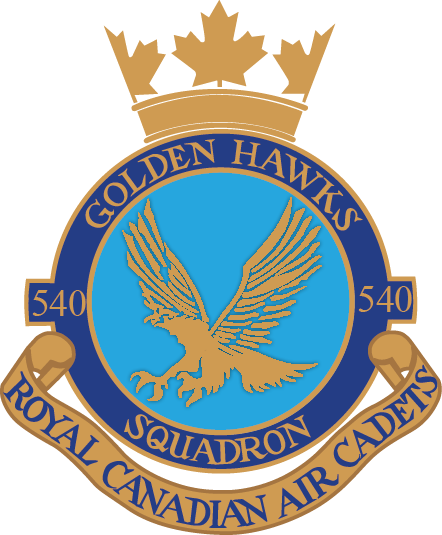

# 540 Squadron Handbook

## Welcome

Dear 540 Squadron family,

On behalf of the Cadets, Staff, and Squadron Sponsoring Committee \(SSC\), we welcome you to the Squadron. We hope that you find your time with us to be an enjoyable, fun, and educational experience.

This handbook is split into the following sections:

1. **Organization** An overview of the Program and Squadron.
2. **Training** Reference material on the cadet program, including how the Squadron operates on any given Tuesday training night, extracurricular opportunities, summer training, and more.
3. **Standards** A set of orders that all members of the Squadron must follow such as how to wear and maintain the uniform as well as rules around appearance, behaviour, and conduct.

