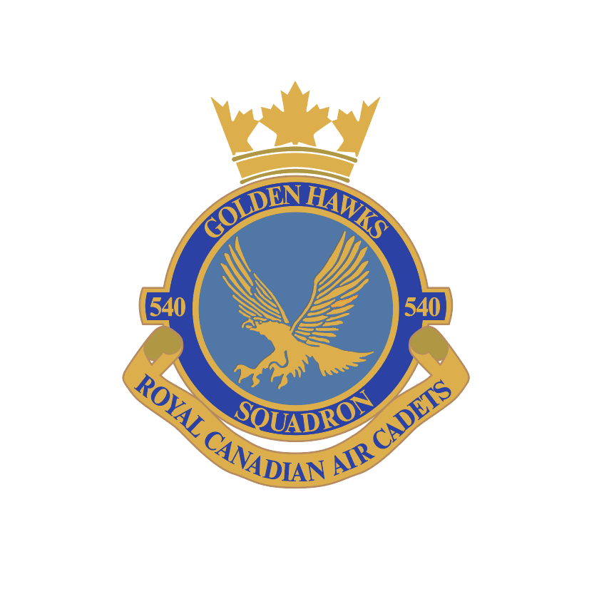

# 540 Squadron Handbook

## Welcome

Dear 540 Squadron family,

On behalf of the Cadets, Staff, and Squadron Sponsoring Committee \(SSC\), we welcome you to the Squadron. We hope that you find your time with us to be an enjoyable, fun, and educational experience.

This handbook is split into the following sections:

1. **Organization** An overview of the Program and Squadron.
2. **Training** Reference material on the cadet program, including how the Squadron operates on any given Tuesday training night, extracurricular opportunities, summer training, and more.
3. **Standards** A set of orders that all members of the Squadron must follow such as how to wear and maintain the uniform as well as rules around appearance, behaviour, and conduct.

This handbook is issued under the authority of the Commanding Officer and is comprised of regulations particular to 540 Golden Hawks Royal Canadian Air Cadet Squadron.

All personnel shall acquaint themselves with, obey, and enforce these orders. Breaches will be dealt with accordingly and ignorance of the contents of these orders will not be accepted as an excuse for failure to obey them.

Personnel are expected to interpret these orders intelligently, bearing in mind that no order can provide for every situation or emergency or replace sound judgment and efficient supervision. Personnel are expected to use their common sense in unusual or emergency situations.

Suggested modifications to this document can be made in writing up the Chain of Command to the Commanding Officer for review and approval.

**M. LaCombe, CD**

Major  
Commanding Officer  
540 Golden Hawks Royal Canadian Air Cadet Squadron  
Canadian Armed Forces  
[co@540goldenhawks.ca](mailto:co@540goldenhawks.ca)  
[540goldenhawks.ca](https://540goldenhawks.ca)

