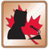
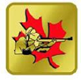

# Badge placement

## **Illustrations**

### **Right sleeve**

### **Left sleeve**

### **Right pocket**

### **Left pocket**

## Jacket sleeves

### Shoulder insignia

This badge is worn at the top of both sleeves of the jacket. The top of the badge is to be 2 cm below the shoulder upper seam, the bottom of the badge must be level to the ground.

### Rank

Rank badges are worn centred, level to the ground, and mid-way between the bent elbow and the upper shoulder seam.

## Right breast pocket

### Name tag

As depicted above.

### Medals

Medals shall only be worn on the jacket with C1 order of dress.

Medals shall be suspended above the right breast pocket of the jacket, immediately above and centred.

When two or more medals are awarded, they shall be worn in order of precedence, without interval, with the highest priority medal closest to the centre of the chest. Medals shall hang in one row so that they are fully visible.

Medals can be worn on formal civilian attire suitable for ceremonial occasions \(e.g. business suit with jacket and tie\).

### Ribbons

Ribbons may be worn with C3 and C3B orders of dress.

Ribbons shall be centred immediately above the right breast pocket of the jacket or shirt.

When two or more ribbons are worn, they shall be worn in rows, without interval between the ribbons and the rows. A maximum of three ribbons shall be worn per row. If a fourth medal is awarded, a second row of ribbons is required. Each new row shall be centred on the lower row. Ribbons shall be worn in order of precedence from left to right of the wearer, with the highest priority ribbon closest to the centre of the chest on the top row if more than one row is required. Where a single ribbon constitutes a row it shall be centred above a lower row.

### Duke of Edinburgh

The Bronze, Silver or Gold pin awarded under the Duke of Edinburgh Award Program shall be worn centred on the right breast pocket, equidistant between the lower seam and the lower edge of the jacket pocket flap.

The pin is worn on the jacket only.

| Bronze | Silver | Gold |
| :---: | :---: | :---: |
|  |  |  |

## Left breast pocket

### Pilot qualifications

The Glider Pilot CTC badge is never worn with the Glider Pilot Wings.

Issued Glider Pilot / Power Pilot sewn \(nylon thread\) insignia shall be worn centred directly above the left breast pocket and horizontal on the cadet jacket and flight suit.

Glider Pilot / Power Pilot pin may be purchased and worn on the jacket and collared shirt when the jacket is removed, centred directly over the left breast pocket and horizontal.

Silver and Gold wire thread embroidered Glider Pilot / Power Pilot badges may be purchased by the cadet and are authorized for wear only on the uniform jacket in lieu of issued wings.

If a cadet successfully completes both Pilot Training Courses, only the Power Pilot Wings shall be worn. The Glider Pilot Training Course CTC Qualification Badge shall then be worn with the other CTC Qualification Badges.

### Effective Speaking Pins

Worn centred on the left jacket pocket, equidistant between the lower seam and the lower edge of the pocket flap.

| Zone Bronze | Provincial Silver | National Gold |
| :---: | :---: | :---: |
|  |  |  |

### Marksmanship & Biathlon

Worn centred on the left jacket pocket, equidistant between the lower seam and the lower edge of the pocket flap.

#### Marksmanship

| Zone Bronze | Provincial Silver | National Gold |
| :---: | :---: | :---: |
|  |  |  |

#### **Biathlon**

| **Zone Bronze** | **Provincial Silver** | **National Gold** |
| :---: | :---: | :---: |
|  |  |  |

## Right sleeve

### Summer training course badges

These badges shall be worn on the right sleeve in the order that they are awarded.

The first badge awarded is centred immediately above the cuff of the uniform jacket. The second badge awarded is placed immediately to the left of the first badge, to the front of the sleeve. The third badge awarded is placed immediately to the right of the first badge, to the rear of the sleeve. The fourth, fifth and sixth badges are placed immediately above badges one, two and three forming a second row of badges and they are placed in the same order as the first row. If a seventh badge is awarded, it shall be placed immediately over the fourth badge.

Only a maximum of seven badges shall be worn.

### Drum Major appointment

The Drum Major appointment badge is worn on the right sleeve of the jacket.

## Left sleeve

### Qualification badges

The following qualification badges can be worn on the left sleeve:

* Proficiency level
* Music proficiency
* Fitness assessment
* First Aid
* Marksman

## Poppy

As depicted.

