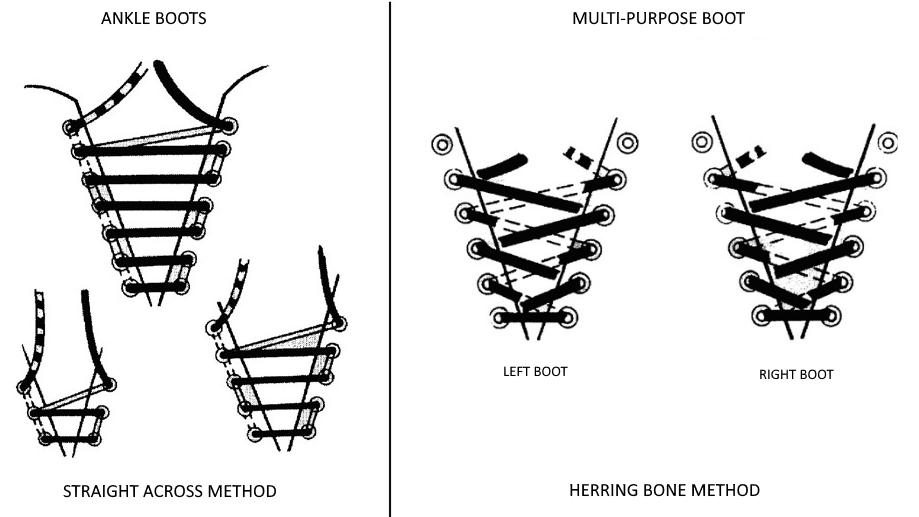

# Wearing the uniform

Each Cadet is to ensure that they are in possession of all items of uniform, and that each item fits correctly. If not, they are to contact the SupO, through the chain of command, and arrange for items to be replaced. All uniforms remain the property of the Squadron, and are to be returned when the cadet leaves the unit.

## Headdress

**Wedge**: Worn on the right side of the head, centred front and back, with the front edge of the cap 2.5 cm \(1 in.\) above the right eyebrow. Two Air Force buttons must be attached in pre-cut holes at the front.

**Toque**: Worn as an alternative winter headdress. Toques shall be worn flush against the top of the head and turned up once to show either a 7.5 cm \(3 in.\) or a 10 cm \(4 in.\) fold according to the design of the toque, with the lower edge of the fold 2.5 cm \(1 in.\) above the eyebrows. The insignia is centered directly over the nose.

**Hijab**: A light blue hijab may be used by female Muslim cadets underneath the applicable headdress.

## Jacket \("tunic"\)

Sleeves shall be roll-pressed with no creases. Jackets shall be worn fully buttoned-up with the exception of the top button.

**Jacket belts**: Worn so that the excess of the belt, once attached, is on the left side of the buckle. The buckle shall be adjusted so that it is centred on the buttons of the jacket.

**Badges and insignia**: Sewn on the uniform neatly using a thread that blends with the badge and uniform. Badges shall not be glued.

## Trousers

Shall be worn with a trousers belt, pressed so as to have a crease down the front and back centre of each leg, and the length of the trousers should extend to the 3rd eyelet from the bottom of the cadet ankle boot.

**Belt for trousers**: The issued narrow black web belt with brass buckle shall be worn with the trousers. Belts should be worn so the excess belt protrudes from the buckle toward the wearer’s left. Buckles with elemental / sqn / CTC badges are authorized for wear with the uniform.

## Blue collared shirt

Worn with tie with or without jacket or open neck without jacket. Rank slip-ons shall be worn with the shirt.

## Necktie

The necktie is knotted neatly using a Windsor knot and shall be kept tight. Conservative tie-pins or clips may be worn.

A great resource to learn how to tie a tie is [ties.com](https://www.ties.com/how-to-tie-a-tie).

## Socks

Grey wool socks may be worn with boots and running shoes. Cadets may elect to wear their own personal socks, grey or black, wool, cotton or nylon, in lieu of the issued grey wool socks. Socks shall not be rolled down.

## Boots

Refer to image below for lacing standard.

**Ankle boots \(“parade boots”\)**: Ankle boots shall be laced across horizontally from side to side. Underlaces shall not be visible except at the top. Boots shall be clean and shone at all times. They will not be modified with any type of metal cleats, hobnails or other metal attachments to heel or sole.

**Multi-purpose boot \(“combat boots”\)**: Intended for wear as environmental dress with the Cadet FTU. Multi-purpose boots shall be cross laced and kept clean at all times. They may be blackened with boot polish but shall not be shone.

## All Season Coat \(“parka”\)

May be worn year round when weather conditions dictate. The liner and the exterior coat may be worn separately or as a set. When worn, the zipper and dome fasteners shall be fully closed to the second from the top button. The liner alone shall not be worn for ceremonial events in public.

## Gloves

Worn when ordered or as required during winter dress.

