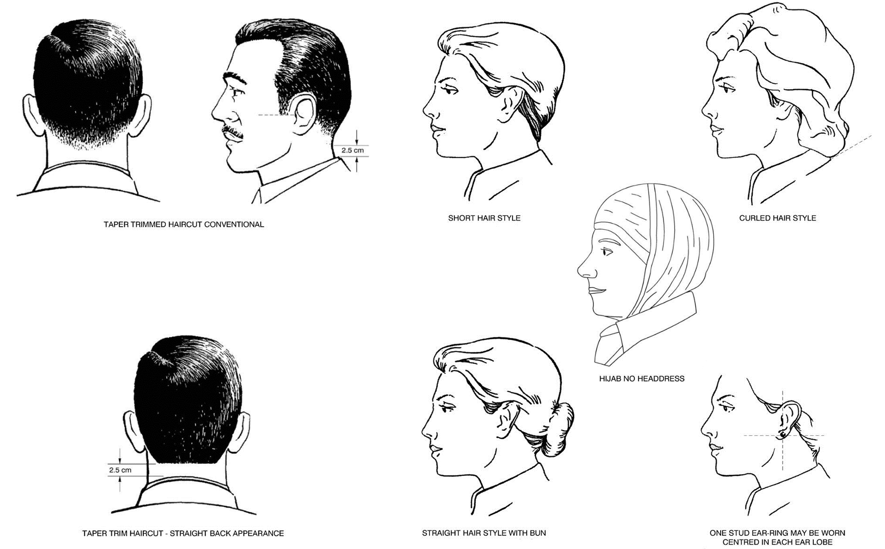

# 5.2 Appearance

## General

Cadets in uniform shall be well groomed, with footwear cleaned and shone, and uniform cleaned and properly pressed. In particular:

* Buttons, fasteners and zippers shall be kept closed
* Pockets shall not be bulged
* Items such as personal mobile devices, portable electronics, glasses, glass cases, sunglasses, pens, pencils, key rings or paper shall not be visibly extended, protrude from pockets or be suspended from waist belts
* Headphones shall not be worn unless in transit to/from a cadet activity

## Hair

Hair on the head shall be neatly groomed and conservatively styled.

The length, bulk or style of hair shall not detract from a positive appearance or preclude the proper wear of cadet headdress. In particular, style and colour shall not present a bizarre, exaggerated, or unusual appearance. Unusual colours, such as green, bright red, orange, purple, etc. are not permitted.

Hair must be secured or styled back to reveal the face, and any accessories used to secure or control hair styles shall be as unobtrusive as possible. Hair ornaments shall not be worn, except conservative hair clip for females. Cadets may use hair gel or hairspray as a personal choice, but are not mandated to do so.

### Male cadets

* Hair shall be taper-trimmed at the back, sides, and above the ears to blend with the hair-style
* Hair shall be no more than 15 cm \(6 in.\) in length and sufficiently short that, when the hair is groomed and headdress is removed, no hair shall touch the ears or fall below the top of the eyebrows
* Hair shall be no more than 4 cm \(1-1/2 in.\) in bulk at the top of the head, gradually decreasing to blend with the taper-trimmed sides and back
* Hair shall be kept free from the neck to a distance of 2.5 cm \(1 in.\) above the shirt collar
* Taper trimmed square back styles and shaving of all the hair on the head are permitted
* Sideburns shall not extend below a line horizontally bisecting the ear, and shall be squared of horizontally at the bottom edge and taper-trimmed to conform to the overall hair style

### Female cadets

* Hair shall not extend below the lower edge of the shirt collar
* Exaggerated styles, including those with excessive fullness or extreme height, are not authorized
* For reference, here is a [video on how to make a bun](https://www.youtube.com/watch?v=CXzelMVZ8Mo).

## Jewellery

Cadets may wear a wrist watch, a Medical Alert identifier, and a maximum of two rings which are not of a costume jewelry nature.

Cadets in uniform may wear a single pair of plain gold, silver stud, white diamond, or pearl earrings in pierced ears. The single stud earring, worn in the centre of each earlobe, shall be spherical in shape and shall not exceed 0.6 cm \(1/4 in.\) in diameter.

In addition to authorized earrings in pierced ears, conservative, non-visible, clear body piercing adornments are permitted to be worn by cadets in uniform or during cadet activities in civilian clothing.

## Makeup

Cadets are authorized to wear a minimal amount of make-up. During cadet activities, make-up shall be applied conservatively.

The use of false eyelashes, heavy eyeliner, brightly coloured eye shadow, coloured nail polish, bright or vivid lipstick and excessive facial make-up is not authorized. Nails must not be excessive in length or present a bizarre, exaggerated, or unusual appearance

## Undergarments

Undergarments, including a brassiere for female cadets, if required, shall be worn under all orders of dress and shall be of an appropriate colour so as not to be visible through uniform and civilian items of clothing.

Undershirts may be worn under any order of dress. Undershirts shall be of a solid colour and free of lettering or designs that will show through the uniform shirt, they shall not be visible at the neck opening or below the sleeves.

## Eyeglasses / sunglasses

Cadets, who normally wear eyeglasses, may wear either conventionally framed prescription sunglasses or conservatively styled clip-on sunglasses when conditions and circumstances dictate. Other cadets may wear conservatively styled sunglasses, which do not detract from the overall appearance of the uniform when conditions and circumstances dictate. Sunglasses shall not be worn on parade unless authorized by the CO in special circumstances.

Sunglasses with mirrored lenses are not authorized for wear.

